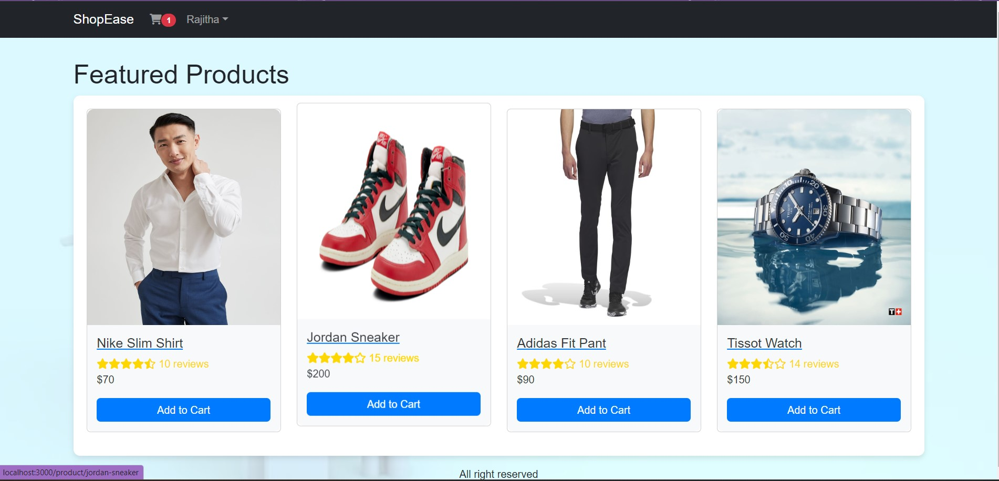
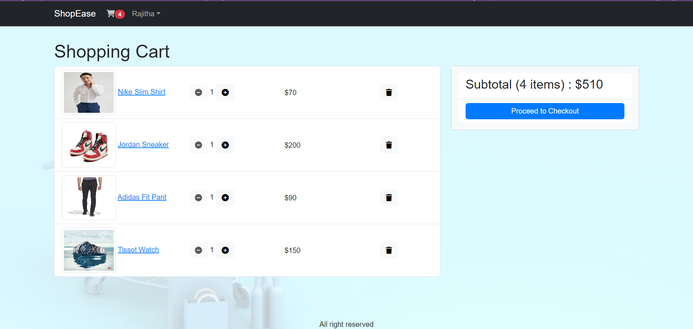
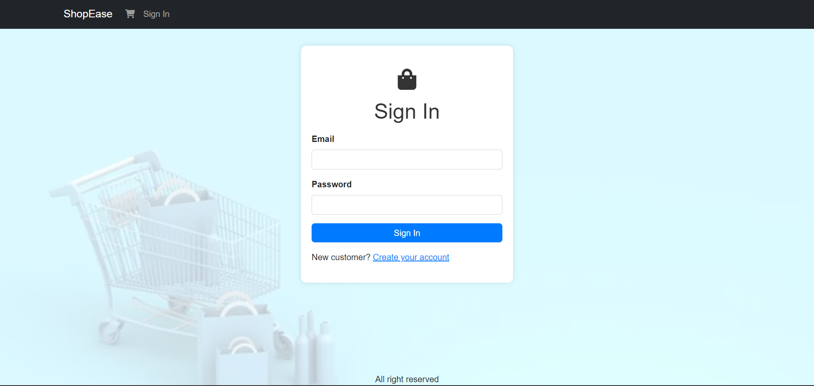

# MERN CART

This project implements a full-stack e-commerce application using the MERN (MongoDB, Express.js, React.js, Node.js) stack. It includes features such as user authentication, product management and shopping cart functionality.

## Appearance

Here are some screenshots showcasing the appearance of the application:

*Home Page*

*Cart Page*

*Sign In Page*

